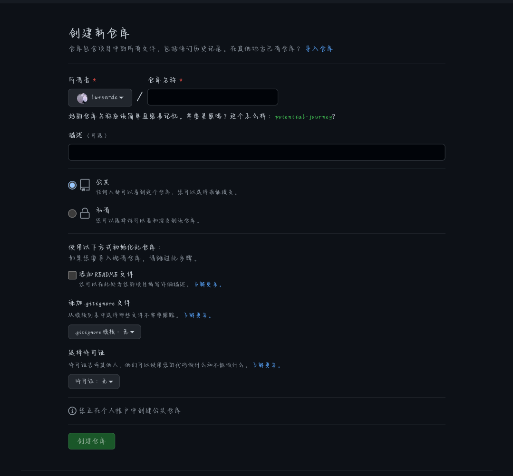
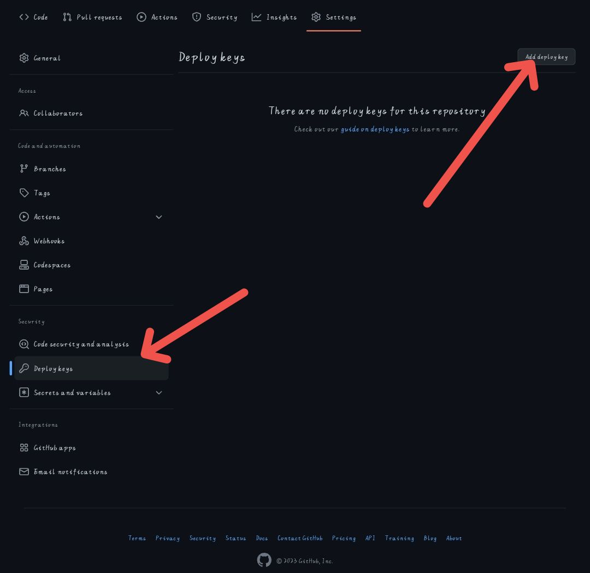
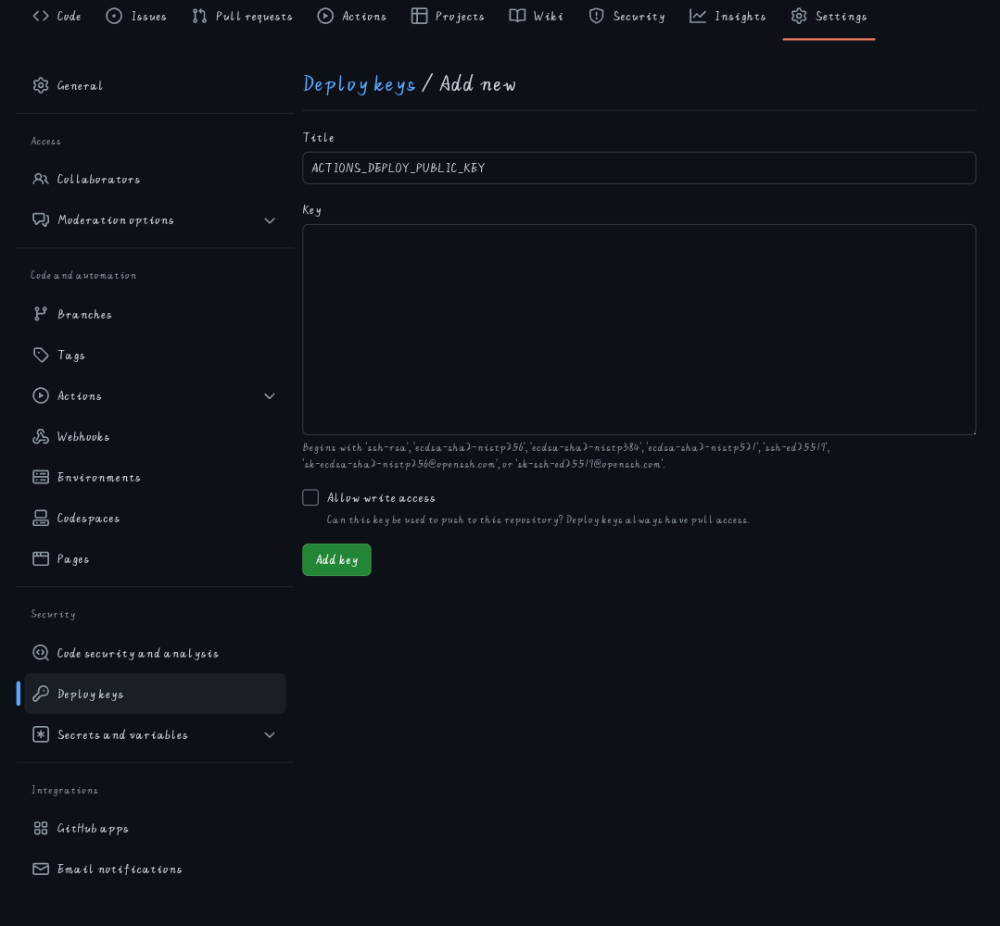
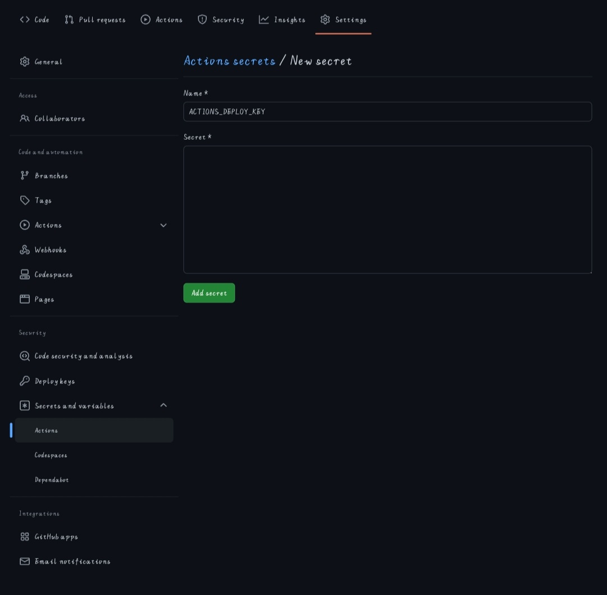
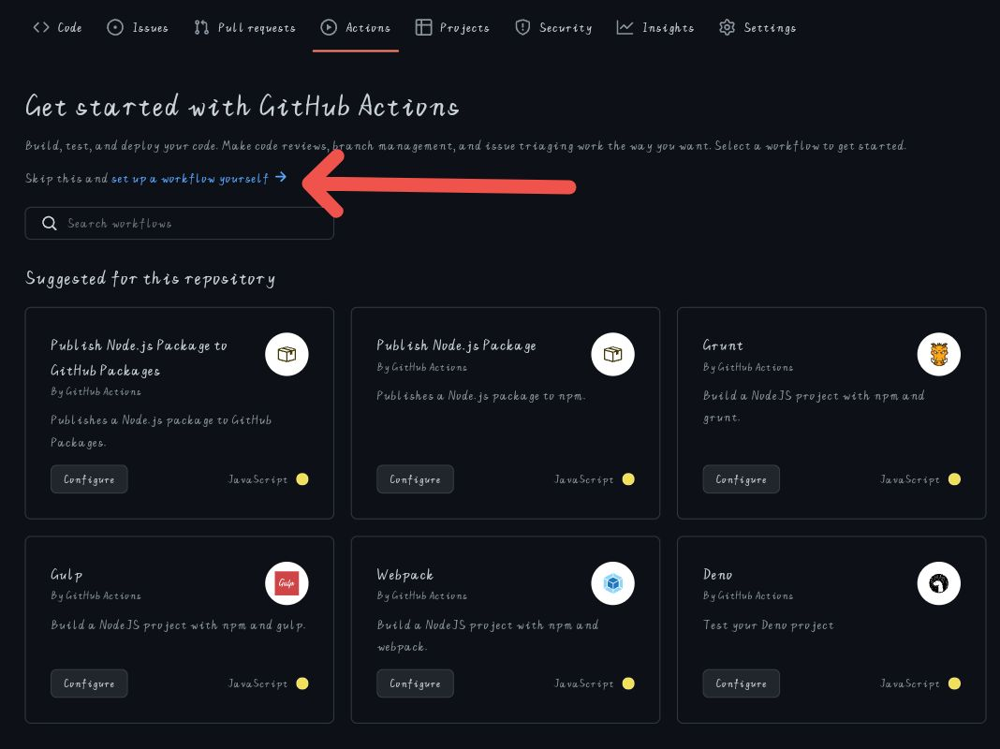

**通过使用 Github Actions 去自动构建 Hexo**
**静态资源并上传 Github Pages**

## 一.创建 Github 仓库



## 二.为创建的 Github 仓库部署秘钥

### 1.生成密钥

```shell
ssh-keygen -t rsa -b 4096 -C "$(git config user.email)" -f hexo-deploy
```

### 2.部署秘钥

在部署 Github Pages 的仓库部署公钥


标题输入：

> ACTIONS_DEPLOY_PUBLIC_KEY

然后在 构建静态资源的仓库添加私钥



标题输入：

> ACTIONS_DEPLOY_KEY

## 三.为构建静态资源的仓库部署 Github Action

选择自定义 workflow 文件名随便



向其中添加以下内容

```yml
name: DeployBlog

on:
  push:

jobs:
  pages:
    runs-on: ubuntu-latest
    name: DeployBlog
    steps:
      - uses: actions/checkout@v3
        with:
          token: ${{ secrets.GITHUB_TOKEN }}
          # If your repository depends on submodule, please see: https://github.com/actions/checkout
          submodules: recursive
      - name: Use Node.js 19
        uses: actions/setup-node@v3
        with:
          node-version: "19"
      - name: Cache NPM dependencies
        uses: actions/cache@v3
        with:
          path: node_modules
          key: ${{ runner.OS }}-npm-cache
          restore-keys: |
            ${{ runner.OS }}-npm-cache
      - name: Install Dependencies
        run: npm install
      - name: Build
        run: npm run build
      - name: Deploy
        uses: peaceiris/actions-gh-pages@v3
        with:
          deploy_key: ${{ secrets.ACTIONS_DEPLOY_KEY }}
          commit_message: ${{ github.event.head_commit.message  }}
          external_repository: <部署静态资源的仓库>
          publish_branch: <部署分支> # default: gh-page
          publish_dir: ./public
```

**然后上传你的源代码到仓库即可自动构建部署**
